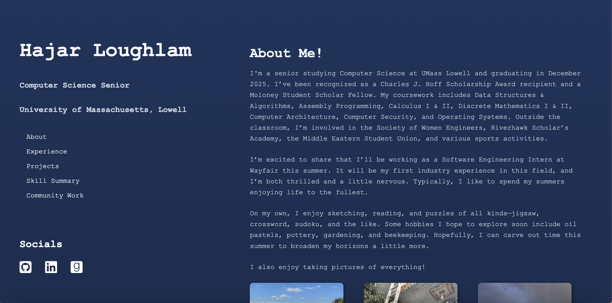

# Hajar Loughlam – Personal Website

This is my personal website, built as part of a GUI assignment at UMass Lowell. 
It serves as a digital resume and creative portfolio to showcase my academic background, professional experience, personal projects, and volunteer work.



## About This Project

Even though this was a homework assignment, I put as much effort as possible because I want this to be something people look at in the future. 
I have had beginner experiences making websites, and I knew that if this assignment was to make a website, I might as well take it seriously. This was an incredible learning experience for me.

I created this site to:

- Practice HTML and CSS layout, structure, and styling
- Showcase my coursework, skills, and work experience
- Explore creative front-end features like Flexbox and hover effects. (I've used flexbox before, but only minimally)
- Finally commit to finishing a portfolio after several past attempts!

---

## Features

- Dark mode aesthetic with soft gradients
- Scrollable content with fixed sidebar
- Interactive icons and tag badges
- Integrated image gallery and skills table

---

## Tech Stack

- **HTML5**
- **CSS3** (vanilla)
- Font Awesome icons
- Google Fonts (`Inter`, `Courier New`)

---

## Credits & Inspiration

- For color codes: https://htmlcolorcodes.com/
- For vertical nav bar: https://www.w3schools.com/html/html_css.asp
- For icons: https://www.w3schools.com/howto/howto_css_social_media_buttons.asp
- For icons and background inspo: https://www.youtube.com/watch?v=ecvmB0HH5MM&ab_channel=HaydnCo
- For smooth-scrolling feature: https://stackoverflow.com/questions/24739126/scroll-to-a-specific-element-using-html
- For fonts: https://www.w3schools.com/cssref/tryit.php?filename=trycss_font_courier

---

## Deployment

To view the site locally:

```bash
git clone https://github.com/hloughlam/personal-portfolio.git
cd personal-portfolio
open index.html
